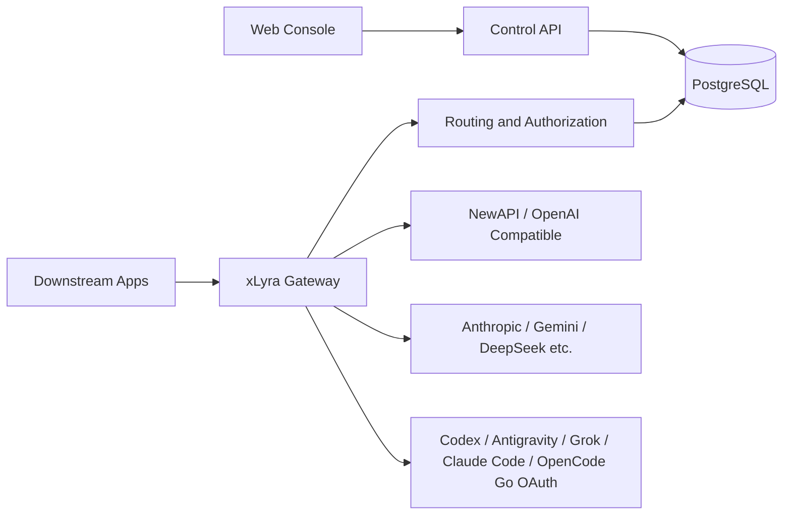

<div align="center">
  
  <h1>xLyra</h1>
  <p>A unified control plane and gateway for multiple upstream AI providers, relay stations, and OAuth-backed accounts.</p>
  <p>
    <a href="https://xlyra.yachiyo.im">Product Website</a> ·
    <a href="#quick-start">Quick Start</a> ·
    <a href="./README_zh.md">简体中文</a>
  </p>
  <p>
    
    
    
    
    <a href="https://hub.docker.com/r/yachiiiiyo/xlyra"></a>
  </p>
</div>

xLyra is a self-hosted AI gateway, LLM proxy, and control plane for aggregating multiple AI providers, relay stations, OAuth accounts, and OpenAI-compatible endpoints.

It provides one API endpoint for OpenAI, Anthropic, Claude Code, Codex, Gemini, Grok, Antigravity, DeepSeek, NewAPI, and other compatible providers.

xLyra supports:

- OpenAI-compatible and Anthropic-compatible APIs
- Chat Completions, Responses, and Messages protocol conversion
- OAuth account orchestration and token refresh
- Multi-site and multi-account model routing
- Health-aware failover and cooldown
- API key quotas and model permissions
- Usage and cost tracking
- Real-time traffic observability
- Self-hosted deployment with Docker Compose

## Why xLyra

| Common problem | How xLyra handles it |
| --- | --- |
| Multiple relay stations and official accounts are managed separately | Centralizes sites, OAuth accounts, upstream keys, models, and prices in one console |
| Downstream apps need to switch between provider-specific formats | Provides one gateway and converts between Chat, Responses, Messages, Images, Embeddings, and Audio |
| Different keys should access different models and sites | Downstream API keys support model allowlists, site allowlists, site group authorization, and model name mapping |
| One upstream failure can affect production traffic | The router selects candidates using health, latency, price, cooldown, and priority, then fails over when possible |
| Cost, failure reasons, and protocol conversion are hard to inspect | Records request logs, usage, estimated cost, upstream/downstream paths, error stages, and streaming state |

## Architecture



The Docker deployment runs two services:

```text
xlyra     # single image: Go backend + React web console served by the built-in HTTP server
postgres  # PostgreSQL database
```

## Gateway Endpoints

The inference endpoints below are under `/v1` and require a downstream API key via `Authorization: Bearer <key>`.

| Method | Path | Description |
| --- | --- | --- |
| `GET` | `/v1/models` | Lists downstream-visible models |
| `POST` | `/v1/chat/completions` | OpenAI Chat Completions (streaming and non-streaming) |
| `POST` | `/v1/responses` | OpenAI Responses API |
| `GET` | `/v1/responses` | OpenAI Responses API over WebSocket (`Upgrade: websocket`) |
| `POST` | `/v1/messages` | Anthropic Messages-style endpoint |
| `POST` | `/v1/images/generations` | Image generation |
| `POST` | `/v1/images/edits` | Image editing (multipart) |
| `POST` | `/v1/embeddings` | Embeddings |
| `POST` | `/v1/audio/speech` | Text-to-speech audio |

### Protocol Conversions

xLyra translates between downstream and upstream protocol formats transparently. Failover is only allowed before the first response byte; once a streaming response starts, xLyra does not switch upstreams.

| Downstream → | Upstream targets |
| --- | --- |
| Chat Completions | OpenAI Chat / Responses / Anthropic Messages / Google Gemini / Antigravity / Grok |
| Responses | Responses / OpenAI Chat / Anthropic Messages / Google Gemini / Antigravity / Grok |
| Messages | Anthropic Messages / Responses / OpenAI Chat / Google Gemini / Antigravity / Codex / Grok |
| Images generations | OpenAI Images / Codex image generation tool / Google Gemini / Antigravity / Grok |
| Images edits | OpenAI multipart / Codex multipart / Grok |
| Embeddings | OpenAI-compatible embeddings |
| Audio speech | OpenAI TTS |

Additional gateway behaviors:

- **Image generation bridge**: when an upstream cannot natively execute `image_generation` tool calls inside Responses, the gateway intercepts and executes the image request itself, then injects the result back into the stream.
- **Long-context tiered pricing**: supported GPT-5.4, GPT-5.5, and GPT-5.6 base-series models automatically use the higher-rate tier above 272K input tokens; Codex, mini, nano, image, audio, and realtime variants are excluded.
- **Model mapping**: downstream API keys can define hard or soft (wildcard fallback) model name mappings. Soft mappings apply only when no direct route is found.
- **SSE keepalive**: streaming responses emit periodic SSE comments to keep long-running connections alive through intermediate proxies.

## Routing and Failover

Routing is not a simple price sort. For each request, the router scores and filters candidates using:

- Site and model enabled state
- Endpoint type support
- Available upstream API key count
- Downstream API key model and site authorization
- Site health, model success rate, average latency, and consecutive failures
- Manual routing priority and cooldown state

### Cooldown behavior

Transient model cooldowns (gateway-source, recoverable failures) use a half-open strategy: the candidate stays in the pool but is sorted below all healthy candidates. A successful attempt clears the cooldown immediately.

| Trigger | Initial duration | Escalation |
| --- | --- | --- |
| Recoverable upstream error | 30 s | Doubles per activation in the last 30 min, capped at 5 min |
| 401 credential error | 5 min | Jumps to 30 min on repeat within the window |
| 429 with Retry-After | Follows Retry-After (5 s – 2 min clamp) | Defaults to 30 s without header |
| Upstream stream failure | Cooldown after 3 consecutive stream failures | Mirrors no-response streak gate |

Concurrency queue timeouts (`upstream_concurrency_wait_timeout`) never trigger a cooldown. The gateway supports global and downstream API-key RPM/TPM limits with an in-memory wait queue. Eligible upstream 429 responses with Retry-After can be retried after waiting, while upstream concurrency can be limited per site, model, or credential.

## Supported Site Types

| Type | Current capability |
| --- | --- |
| OpenAI Compatible / official API-key sites | Credential validation, model sync, and protocol forwarding |
| Anthropic | Messages forwarding, plus Chat / Responses ↔ Messages conversion |
| Grok | OAuth CLI channel, multi-account management, image generation, tier-based model availability |
| OpenCode Go | Subscription plan models and quota-based routing |
| DeepSeek / Minimax / Moonshot / Kimi Code / Xiaomi MiMo / Google Gemini | Credential, model sync, or compatible protocol forwarding depending on site type |
| GLM / GLM Code (Zhipu) | General API and Coding Plan credential validation, model sync, and compatible protocol forwarding |
| xLyra | Cascade relay: model sync with ETag caching, downstream API key list and summary, admin user summary |
| NewAPI | Site detection, user summary, API key list, key summary, check-in, model sync, and price sync |
| Codex | OAuth, ChatGPT account quota, model sync, Responses protocol, and image generation tool conversion |
| Antigravity | OAuth, project / quota fetching, text and image conversion to Gemini-style protocol |
| Claude Code | OAuth authorization and client impersonation forwarding |

## Console Features

### Sites and Credentials

- Create, edit, enable, disable, delete, validate, and refresh upstream sites
- Per-site API key management: add, update, rotate, and per-key refresh with error isolation
- Codex / Antigravity / Claude Code OAuth authorization and refresh, plus provider-supported model and quota sync
- Grok OAuth device login, multi-account management, model permissions, and quota refresh
- Codex / Antigravity OAuth account import
- Codex reset-credit lookup and redemption
- Site upstream balance probing: balance and usage displayed per-credential

### Models and Pricing

- Model catalog, canonical models, aliases, site model binding, and support matrix
- Manual canonical model pricing with automatic propagation as global fallback
- LiteLLM and models.dev price sync; manual prices are not overwritten by automated sync
- Site-level and site-group pricing multipliers
- Long-context tiered pricing for OpenAI models

### Downstream API Keys

- Key management, quotas, expiration, model permissions, site permissions, and site group authorization
- Model name mapping rules (hard and soft / wildcard)
- Daily and weekly quota periods with automatic reset
- Public per-key usage portal page (no admin login required; the corresponding downstream API key is required to access usage data)

### Routing and Health

- Route candidates, current routes, traces, health states, and cooldown records
- Manual route selection, failover, and cooldown management
- Site health history, hourly breakdown, and proactive health checks

### Observability

- Request logs with filters, pagination, full request detail, usage, and cost estimation
- Usage channel-split: aggregate usage broken down by downstream key, model, and site
- Dashboard: RPM, token throughput, cost, active key heatmap, and cooldown summary
- Real-time traffic flow graph: live in-flight requests visualized as a node-link topology
- Model playground: multi-protocol interactive testing (Chat, Responses, Messages) with attachment support

### System

- Admin login, profile, password, TOTP, sessions, access token, and audit logs
- Backup and restore: manual export / import and automatic S3-compatible scheduled backups
- System proxy configuration with connectivity test

## Alternatives and Related Projects

xLyra is designed as a self-hosted control plane for multi-site AI routing.

Compared with a basic OpenAI proxy, xLyra adds:

- Multiple site and credential management
- OAuth account orchestration
- OpenAI / Anthropic / Gemini protocol conversion
- Model and site permissions
- Health-aware routing and failover
- Usage and cost observability


## Quick Start

Prerequisites:

- Docker
- Docker Compose

Start:

```bash
docker compose up -d
```

Default console:

```text
http://localhost:5801
```

Create the first admin account on the initial console visit. Later logins use server-side session cookies.

Stop:

```bash
docker compose down
```

`docker compose down -v` does not remove this project's bind-mounted `./postgres` and `./data` directories. To clear persisted data, stop the services first, then back up and explicitly remove those directories yourself. The `./data/conf/master.key` file is required to decrypt stored credentials.

Before public or shared deployment, at minimum change the default PostgreSQL password in `docker-compose.yml`, then configure HTTPS, reverse proxy, allowed CORS origins, and IP allowlists. The application encryption key is generated automatically on first startup and persisted at `./data/conf/master.key`.

## Configuration

Default Docker data mounts:

```text
./postgres  -> PostgreSQL data
./data      -> backend runtime data, config, and master.key
```

Common environment variables:

| Variable | Description |
| --- | --- |
| `APP_ENV` | Runtime environment: `development`, `test`, `staging`, or `production` |
| `HTTP_PORT` | Backend listen port, default `5801` |
| `POSTGRES_DSN` | PostgreSQL DSN; takes precedence over split database settings |
| `DB_HOST` / `DB_PORT` / `DB_NAME` | Database host, port, and database name |
| `DB_USER` / `DB_PASSWORD` | Database username and password |

## Local Development

Local development requires Go 1.26.5, Node.js 24, and a running PostgreSQL 17 instance. The example below connects to `127.0.0.1:5432` with database `xlyra`, user `postgres`, and password `postgres`; environment variables can override these values.

Install frontend dependencies:

```bash
cd web
npm ci
```

Start the backend. You must first set `POSTGRES_DSN` or provide `DB_HOST`, `DB_PORT`, `DB_NAME`, `DB_USER`, and `DB_PASSWORD`:

```bash
cd server
DB_HOST=127.0.0.1 DB_NAME=xlyra DB_USER=postgres DB_PASSWORD=postgres go run ./cmd/server
```

Start the frontend in another terminal:

```bash
cd web
npm run dev
```

The frontend defaults to `http://localhost:5173`, and the backend defaults to `http://localhost:5801`.

Verification:

```bash
cd web
npm run typecheck
npm run lint
npm run build
```

```bash
cd server
go test ./...
go build ./cmd/server
```

## Tech Stack

| Layer | Technology |
| --- | --- |
| Backend | Go, net/http, chi, GORM, PostgreSQL, goose, robfig/cron, slog |
| Frontend | TypeScript, React, Vite, React Router, Tailwind CSS, TanStack Query, TanStack Table, Zustand, Recharts, i18next |
| Deployment | Docker, Docker Compose, built-in Go HTTP server |

## License

xLyra is licensed under the [GNU Affero General Public License v3.0](./LICENSE).
