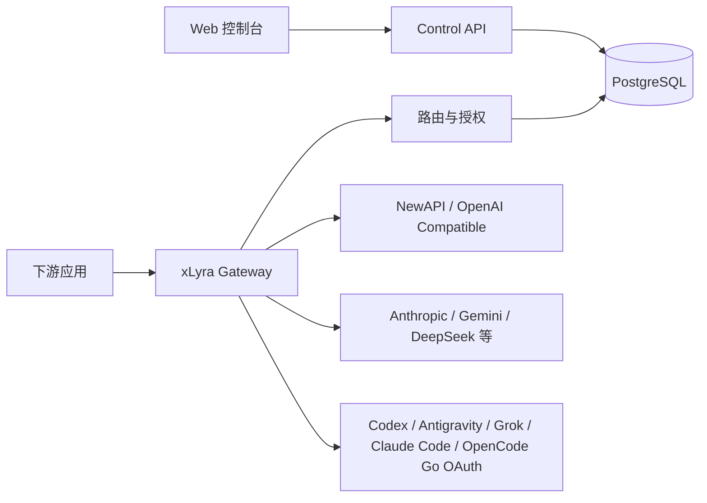

<div align="center">
  
  <h1>xLyra</h1>
  <p>面向多上游 AI 服务、AI 中转站和 OAuth 账号的统一控制面与网关。</p>
  <p>
    <a href="https://xlyra.yachiyo.im">产品主页</a> ·
    <a href="#快速开始">快速开始</a> ·
    <a href="./README.md">English</a>
  </p>
  <p>
    
    
    
    
    <a href="https://hub.docker.com/r/yachiiiiyo/xlyra"></a>
  </p>
</div>

xLyra 是一个自托管 AI 网关、LLM 代理和控制面，用于聚合多个 AI 服务商、中转站、OAuth 账号以及 OpenAI 兼容接口。

它为 OpenAI、Anthropic、Claude Code、Codex、Gemini、Grok、Antigravity、DeepSeek、NewAPI 及其他兼容服务商提供统一的 API 入口。

xLyra 支持：

- OpenAI 兼容和 Anthropic 兼容 API
- Chat Completions、Responses 和 Messages 协议转换
- OAuth 账号编排与 Token 刷新
- 多站点、多账号模型路由
- 基于健康状态的故障转移与冷却机制
- API Key 配额与模型权限
- 用量与成本统计
- 实时流量可观测性
- 使用 Docker Compose 自托管部署

## 为什么需要 xLyra

| 常见问题 | xLyra 的处理方式 |
| --- | --- |
| 多个中转站和官方账号分散管理 | 将站点、OAuth 账号、上游 Key、模型和价格统一纳入控制台 |
| 下游应用要切换不同 provider 的接口格式 | 提供统一网关，在 Chat、Responses、Messages、Images、Embeddings、Audio 间做协议转换 |
| 不同 Key 能访问的模型和站点不同 | 下游 API Key 支持模型 allowlist、站点 allowlist、站点组授权和模型名映射 |
| 某个上游失败会直接影响业务 | 路由引擎结合健康、延迟、价格、冷却和优先级选择候选，并在可行时 failover |
| 请求成本、失败原因和协议转换不可见 | 记录请求日志、usage、成本估算、上下游路径、错误阶段和流式状态 |

## 系统架构



Docker 部署时由两个服务组成：

```text
xlyra     # 单镜像：Go 后端 + React 控制台，由内置 HTTP Server 直接提供服务
postgres  # PostgreSQL 数据库
```

## 网关端点

下列推理端点均位于 `/v1` 路径下，需通过 `Authorization: Bearer <key>` 携带下游 API Key。

| 方法 | 路径 | 说明 |
| --- | --- | --- |
| `GET` | `/v1/models` | 查询下游可见模型 |
| `POST` | `/v1/chat/completions` | OpenAI Chat Completions（流式与非流式） |
| `POST` | `/v1/responses` | OpenAI Responses API |
| `GET` | `/v1/responses` | OpenAI Responses API over WebSocket（`Upgrade: websocket`） |
| `POST` | `/v1/messages` | Anthropic Messages-style 端点 |
| `POST` | `/v1/images/generations` | 图片生成 |
| `POST` | `/v1/images/edits` | 图片编辑（multipart） |
| `POST` | `/v1/embeddings` | Embeddings |
| `POST` | `/v1/audio/speech` | 文字转语音 |

### 协议转换

xLyra 在下游和上游协议格式之间透明转换。Failover 只允许发生在响应第一个字节写出之前；流式响应开始后不会切换上游，以保证下游协议语义完整。

| 下游请求 → | 可路由的上游协议 |
| --- | --- |
| Chat Completions | OpenAI Chat / Responses / Anthropic Messages / Google Gemini / Antigravity / Grok |
| Responses | Responses / OpenAI Chat / Anthropic Messages / Google Gemini / Antigravity / Grok |
| Messages | Anthropic Messages / Responses / OpenAI Chat / Google Gemini / Antigravity / Codex / Grok |
| Images generations | OpenAI Images / Codex 图片生成工具 / Google Gemini / Antigravity / Grok |
| Images edits | OpenAI multipart / Codex multipart / Grok |
| Embeddings | OpenAI-compatible embeddings |
| Audio speech | OpenAI TTS |

其他网关行为：

- **生图工具桥接**：当上游在 Responses 流中无法原生执行 `image_generation` 工具调用时，网关代为发起图片请求，并将结果注入回流式响应。
- **长上下文阶梯计价**：受支持的 GPT-5.4、GPT-5.5 和 GPT-5.6 基础系列模型输入超 272K tokens 时，自动应用高档费率；Codex、mini、nano、图片、音频和实时模型等变体不适用。
- **模型映射**：下游 API Key 可配置硬映射或软映射（通配兜底）。软映射仅在找不到直接路由时生效。
- **SSE 心跳保活**：流式响应定期发送 SSE 注释，防止长连接被中间代理断开。

## 路由与失败转移

路由选择不只按价格排序，会对每个请求综合评分和过滤候选：

- 站点和模型启用状态
- endpoint type 支持情况
- 可用上游 API Key 数量
- 下游 API Key 的模型与站点授权
- 站点健康、模型成功率、平均延迟和连续失败
- 手工路由优先级和冷却状态

### 冷却机制

瞬态模型冷却（网关触发的可恢复失败）采用半开策略：候选仍保留在池中，但排在所有健康候选之后。成功一次后立即解冷。

| 触发原因 | 初始时长 | 升级规则 |
| --- | --- | --- |
| 可恢复上游错误 | 30 秒 | 30 分钟内每次激活翻倍，上限 5 分钟 |
| 401 凭证错误 | 5 分钟 | 窗口内重复触发升至 30 分钟 |
| 429 带 Retry-After | 跟随 Retry-After（5 秒–2 分钟区间限制） | 无头部时默认 30 秒 |
| 上游流式中断 | 连续 3 次流式失败后触发冷却 | 与无响应连续失败门限一致 |

并发队列超时（`upstream_concurrency_wait_timeout`）不触发冷却。网关支持全局和下游 API Key 级 RPM/TPM 限流及内存等待队列；对符合条件且返回 Retry-After 的上游 429，可等待后重试。上游并发限制可按站点、模型和凭证配置。

## 支持的站点类型

| 类型 | 当前能力 |
| --- | --- |
| OpenAI Compatible / 官方 API Key 类站点 | 凭证校验、模型同步、协议转发 |
| Anthropic | Messages 协议转发，支持 Chat / Responses ↔ Messages 转换 |
| Grok | OAuth CLI 通道、多账号管理、图片生成、按 tier 分档模型可用性 |
| OpenCode Go | 订阅套餐模型与额度路由 |
| DeepSeek / Minimax / Moonshot / Kimi Code / 小米 MiMo / Google Gemini | 按站型适配凭证、模型同步或兼容协议转发 |
| GLM / GLM Code（智谱） | 通用 API 与 Coding Plan 凭证校验、模型同步、兼容协议转发 |
| xLyra | 级联中转：带 ETag 缓存的模型同步、下游 API Key 清单与摘要、管理员用户摘要 |
| NewAPI | 站点探测、用户摘要、API Key 清单、Key 摘要、签到、模型和价格同步 |
| Codex | OAuth、ChatGPT 账号额度、模型同步、Responses 协议和图片生成工具转换 |
| Antigravity | OAuth、项目/配额抓取，文本与图片请求到 Gemini-style 协议转换 |
| Claude Code | OAuth 授权和客户端伪装转发 |

## 控制台功能

### 站点与凭证

- 站点创建、编辑、启停、删除、校验和刷新
- 站点 API Key 管理：新增、更新、轮换和单 Key 刷新（含错误隔离）
- Codex / Antigravity / Claude Code OAuth 授权与刷新，以及各提供商支持的模型和额度同步
- Grok OAuth 设备登录、多账号管理、模型权限和额度刷新
- Codex / Antigravity OAuth 账号导入
- Codex 重置额度查询与兑换
- 上游凭证余额探测：按凭证展示余额与已用量

### 模型与价格

- 模型广场、标准模型、alias、站点模型绑定和支持矩阵
- 手动标准模型价格，自动作为全局兜底向所有站点传播
- LiteLLM 和 models.dev 自动价格同步；手动价格不被自动同步覆盖
- 站点级和站点组价格倍率
- OpenAI 模型长上下文阶梯计价

### 下游 API Key

- Key 管理、额度、过期时间、模型权限、站点权限和站点组授权
- 模型名映射规则（硬映射和软映射/通配兜底）
- 日/周额度周期与自动重置
- 每个 Key 的公开用量门户页（无需管理员登录，访问数据时需输入对应的下游 API Key）

### 路由与健康

- 路由候选、当前路由、trace、健康状态和冷却记录
- 手动路由选择、失败转移和冷却管理
- 站点健康历史、小时级明细和主动健康检查

### 可观测性

- 请求日志：筛选、分页、完整请求详情、用量和成本估算
- 用量分账统计：按下游 Key、模型、站点聚合拆分
- 仪表盘：RPM、Token 吞吐、成本、活跃 Key 热力图和冷却摘要
- 实时请求流图：在途请求以节点连线拓扑形式实时可视化
- 模型体验工作台：多协议交互测试（Chat、Responses、Messages），支持附件对话

### 系统

- 管理员登录、资料、密码、TOTP、会话、Access Token 和审计日志
- 备份与恢复：手动导出/导入，以及 S3 兼容的自动定期备份
- 系统代理配置与连通性测试

## 替代方案与相关项目

xLyra 定位为面向多站点 AI 路由的自托管控制面。

相比基础的 OpenAI 代理，xLyra 额外提供：

- 多站点与凭据管理
- OAuth 账号编排
- OpenAI / Anthropic / Gemini 协议转换
- 模型与站点权限控制
- 基于健康状态的路由与故障转移
- 用量与成本可观测性


## 快速开始

前置要求：

- Docker
- Docker Compose

启动：

```bash
docker compose up -d
```

默认控制台：

```text
http://localhost:5801
```

首次访问控制台时创建第一个管理员账号。后续登录使用服务端 Session Cookie。

停止：

```bash
docker compose down
```

`docker compose down -v` 不会删除本项目通过目录绑定挂载的 `./postgres` 和 `./data`。如需清理持久化数据，请先停止服务，再自行备份并明确删除这两个目录；其中 `./data/conf/master.key` 用于解密已保存的凭证。

公网或多人共享部署前，请至少修改 `docker-compose.yml` 中的默认 PostgreSQL 密码，并配置 HTTPS、反向代理、CORS 来源和 IP 白名单。应用加密密钥会在首次启动时自动生成，并持久化到 `./data/conf/master.key`。

## 常用配置

Docker 默认数据挂载：

```text
./postgres  -> PostgreSQL 数据
./data      -> 后端运行数据、配置和 master.key
```

常用环境变量：

| 变量 | 说明 |
| --- | --- |
| `APP_ENV` | 运行环境，支持 `development`、`test`、`staging`、`production` |
| `HTTP_PORT` | 后端监听端口，默认 `5801` |
| `POSTGRES_DSN` | PostgreSQL DSN；设置后优先于拆分式数据库配置 |
| `DB_HOST` / `DB_PORT` / `DB_NAME` | 数据库地址、端口和库名 |
| `DB_USER` / `DB_PASSWORD` | 数据库用户名和密码 |

## 本地开发

本地开发需要 Go 1.26.5、Node.js 24 和可用的 PostgreSQL 17 实例。以下示例连接 `127.0.0.1:5432`，数据库名、用户和密码分别为 `xlyra`、`postgres` 和 `postgres`，可通过环境变量覆盖。

安装前端依赖：

```bash
cd web
npm ci
```

启动后端。必须先配置 `POSTGRES_DSN`，或提供 `DB_HOST`、`DB_PORT`、`DB_NAME`、`DB_USER` 和 `DB_PASSWORD`：

```bash
cd server
DB_HOST=127.0.0.1 DB_NAME=xlyra DB_USER=postgres DB_PASSWORD=postgres go run ./cmd/server
```

在另一个终端启动前端：

```bash
cd web
npm run dev
```

默认前端地址为 `http://localhost:5173`，后端地址为 `http://localhost:5801`。

验证：

```bash
cd web
npm run typecheck
npm run lint
npm run build
```

```bash
cd server
go test ./...
go build ./cmd/server
```

## 技术栈

| 层 | 技术 |
| --- | --- |
| 后端 | Go、net/http、chi、GORM、PostgreSQL、goose、robfig/cron、slog |
| 前端 | TypeScript、React、Vite、React Router、Tailwind CSS、TanStack Query、TanStack Table、Zustand、Recharts、i18next |
| 部署 | Docker、Docker Compose、内置 Go HTTP Server |

## License

xLyra 使用 [GNU Affero General Public License v3.0](./LICENSE)。
